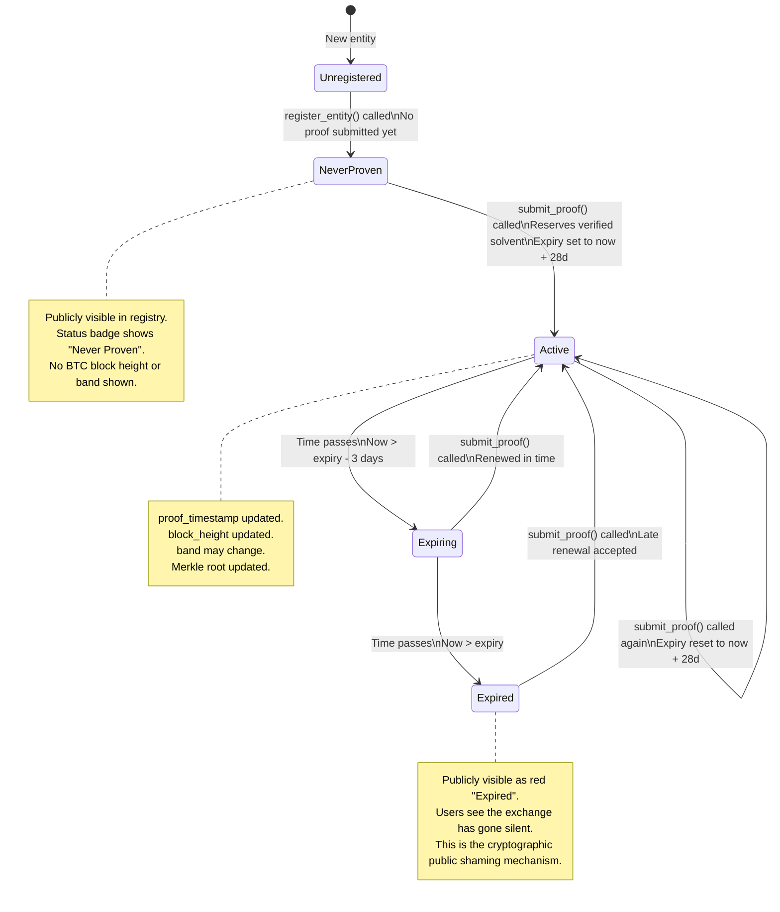
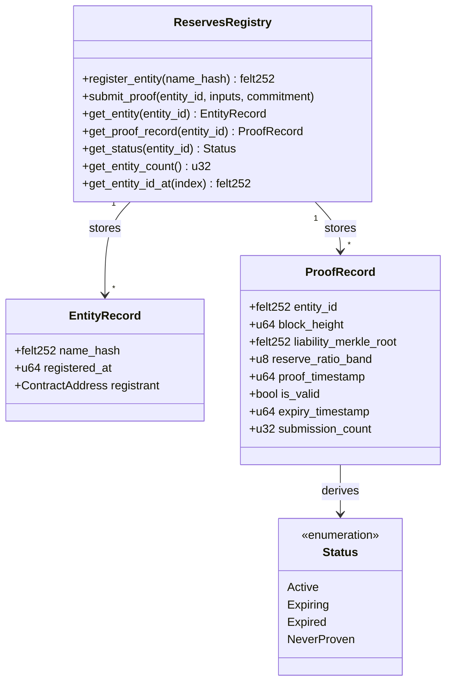
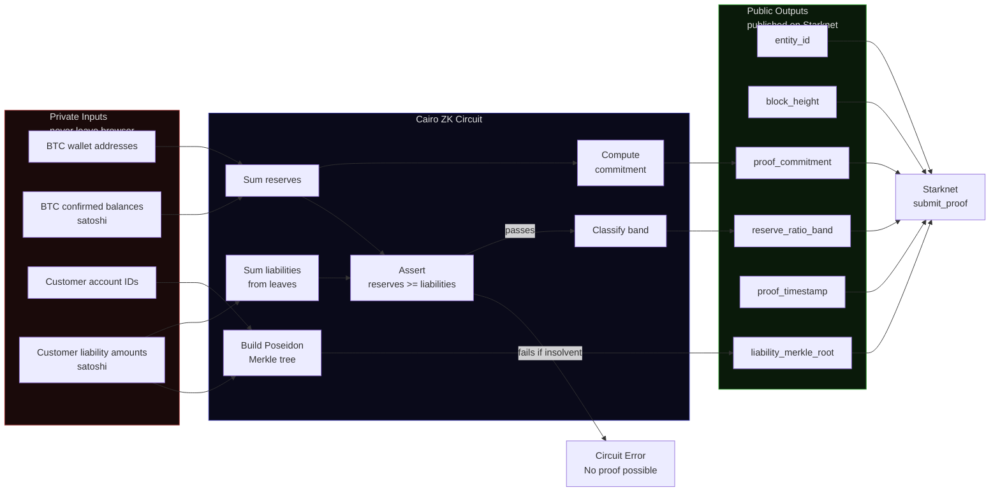
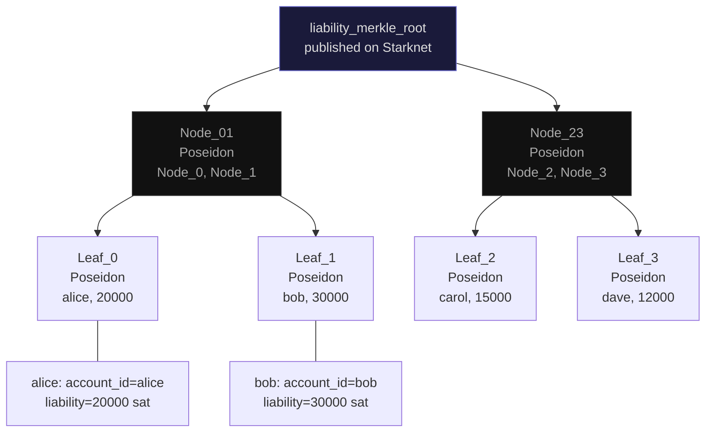

# Proof Lifecycle

## Proof State Machine

```mermaid
stateDiagram-v2
    [*] --> Unregistered : New entity

    Unregistered --> NeverProven : register_entity() called\nNo proof submitted yet

    NeverProven --> Active : submit_proof() called\nReserves verified solvent\nExpiry set to now + 28d

    Active --> Active : submit_proof() called again\nExpiry reset to now + 28d

    Active --> Expiring : Time passes\nNow > expiry - 3 days

    Expiring --> Active : submit_proof() called\nRenewed in time

    Expiring --> Expired : Time passes\nNow > expiry

    Expired --> Active : submit_proof() called\nLate renewal accepted

    note right of NeverProven
        Publicly visible in registry.
        Status badge shows "Never Proven".
        No BTC block height or band shown.
    end note

    note right of Active
        proof_timestamp updated.
        block_height updated.
        band may change.
        Merkle root updated.
    end note

    note right of Expired
        Publicly visible as red "Expired".
        Users see the exchange has gone silent.
        This is the cryptographic public shaming mechanism.
    end note
```

---

## Proof Record Structure

```mermaid
classDiagram
    class EntityRecord {
        +felt252 name_hash
        +u64 registered_at
        +ContractAddress registrant
    }

    class ProofRecord {
        +felt252 entity_id
        +u64 block_height
        +felt252 liability_merkle_root
        +u8 reserve_ratio_band
        +u64 proof_timestamp
        +bool is_valid
        +u64 expiry_timestamp
        +u32 submission_count
    }

    class ReservesRegistry {
        +register_entity(name_hash) felt252
        +submit_proof(entity_id, inputs, commitment)
        +get_entity(entity_id) EntityRecord
        +get_proof_record(entity_id) ProofRecord
        +get_status(entity_id) Status
        +get_entity_count() u32
        +get_entity_id_at(index) felt252
    }

    class Status {
        <<enumeration>>
        Active
        Expiring
        Expired
        NeverProven
    }

    ReservesRegistry "1" --> "*" EntityRecord : stores
    ReservesRegistry "1" --> "*" ProofRecord : stores
    ProofRecord --> Status : derives
```

---

## ZK Circuit -- Input/Output Map

```mermaid
flowchart LR
    subgraph Private [Private Inputs\nnever leave browser]
        PA[BTC wallet addresses]
        PB[BTC confirmed balances\nsatoshi]
        PC[Customer account IDs]
        PD[Customer liability amounts\nsatoshi]
    end

    subgraph Circuit [Cairo ZK Circuit]
        C1[Sum reserves]
        C2[Build Poseidon\nMerkle tree]
        C3[Sum liabilities\nfrom leaves]
        C4[Assert\nreserves >= liabilities]
        C5[Classify band]
        C6[Compute\ncommitment]
    end

    subgraph Public [Public Outputs\npublished on Starknet]
        O1[entity_id]
        O2[block_height]
        O3[liability_merkle_root]
        O4[reserve_ratio_band]
        O5[proof_timestamp]
        O6[proof_commitment]
    end

    PA --> C1
    PB --> C1
    PC --> C2
    PD --> C2
    PD --> C3

    C1 --> C4
    C3 --> C4
    C4 -->|fails if insolvent| ERR[Circuit Error\nNo proof possible]
    C4 -->|passes| C5
    C2 --> O3
    C5 --> O4
    C1 --> C6
    C6 --> O6

    O1 --> SN[Starknet\nsubmit_proof]
    O2 --> SN
    O3 --> SN
    O4 --> SN
    O5 --> SN
    O6 --> SN

    style Private fill:#1a0a0a,stroke:#aa3333,color:#ddd
    style Circuit fill:#0a0a1a,stroke:#3333aa,color:#ddd
    style Public fill:#0a1a0a,stroke:#33aa33,color:#ddd
```

---

## Merkle Tree Construction

```mermaid
graph TB
    R[liability_merkle_root\npublished on Starknet]

    N01[Node_01\nPoseidon\nNode_0, Node_1]
    N23[Node_23\nPoseidon\nNode_2, Node_3]

    L0[Leaf_0\nPoseidon\nalice, 20000]
    L1[Leaf_1\nPoseidon\nbob, 30000]
    L2[Leaf_2\nPoseidon\ncarol, 15000]
    L3[Leaf_3\nPoseidon\ndave, 12000]

    R --> N01
    R --> N23
    N01 --> L0
    N01 --> L1
    N23 --> L2
    N23 --> L3

    note1[alice: account_id=alice\nliability=20000 sat]
    note2[bob: account_id=bob\nliability=30000 sat]

    L0 --- note1
    L1 --- note2

    style R fill:#1a1a3a,stroke:#6666cc,color:#ddd
    style N01 fill:#111,stroke:#333,color:#aaa
    style N23 fill:#111,stroke:#333,color:#aaa
```
