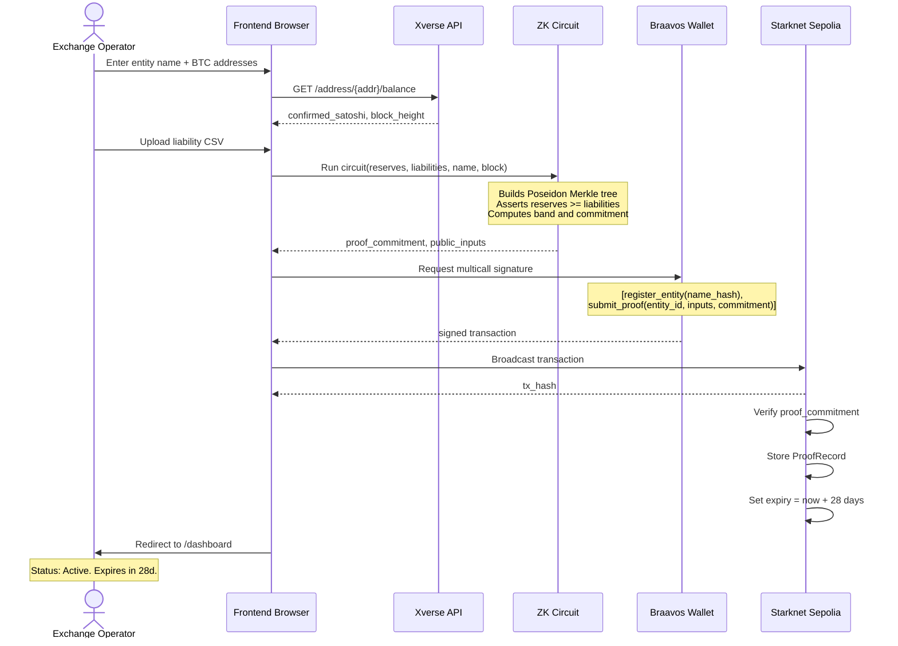

# System Architecture

## Full System Diagram

```mermaid
graph TB
    subgraph Browser [Browser -- Operator]
        UI[Next.js Frontend]
        ZK[ZK Circuit Runner\nCairo WASM]
        MK[Poseidon Merkle\nTree Builder]
        XV[Xverse BTC\nBalance Fetcher]
    end

    subgraph API [Next.js API Routes]
        PG[/api/proof/generate\nRuns ZK circuit]
        PS[/api/proof/submit\nRelays to Starknet]
        ES[/api/ecosystem/stats\nAggregate stats]
        VM[/api/verify/manual\nProof verification]
        SC[/api/scheduler/check\nExpiry watchdog]
    end

    subgraph Starknet [Starknet Sepolia]
        RR[ReservesRegistry.cairo\nentity_id -> ProofRecord]
        PSC[ProofScheduler.cairo\nExpiry enforcement]
    end

    subgraph BTC [Bitcoin Network]
        XAPI[Xverse API\nBalance + block height]
        BTC[Bitcoin Blockchain\nUTXO set]
    end

    UI --> ZK
    UI --> MK
    XV --> XAPI
    XAPI --> BTC

    UI --> PG
    PG --> ZK
    PG --> MK
    UI --> PS
    PS --> RR
    PS --> PSC
    UI --> ES
    ES --> RR
    UI --> VM

    RR --> PSC
    PSC --> SC

    style Browser fill:#111,stroke:#333,color:#ddd
    style API fill:#0d0d0d,stroke:#2a2a2a,color:#ddd
    style Starknet fill:#0a0a1a,stroke:#3333aa,color:#ddd
    style BTC fill:#1a0f00,stroke:#aa6600,color:#ddd
```

---

## Data Flow -- Proof Submission



---

## Component Dependency Map

```mermaid
graph LR
    subgraph Pages
        LP[/ Landing]
        REG[/registry]
        ONB[/onboard]
        DASH[/dashboard]
        PRV[/prove]
        ENT[/entity/id]
        VER[/verify]
    end

    subgraph Components
        NAV[Navbar]
        ET[EntityTable]
        PSB[ProofStatusBadge]
        RRB[ReserveRatioBand]
        EHB[EcosystemHealthBanner]
        LBT[LiveBlockTicker]
        PT[ProofTimeline chart]
        RD[RatioDistribution chart]
        PC[ProofCountdown]
    end

    subgraph Lib
        SK[lib/starknet.ts]
        MK[lib/merkle.ts]
        CIR[lib/circuit.ts]
        XVL[lib/xverse.ts]
    end

    REG --> ET
    REG --> EHB
    REG --> LBT
    REG --> SK

    ET --> PSB
    ET --> RRB
    ET --> PC

    ONB --> XVL
    ONB --> MK
    ONB --> CIR
    ONB --> SK

    DASH --> PT
    DASH --> RD
    DASH --> PSB
    DASH --> SK

    PRV --> XVL
    PRV --> MK
    PRV --> CIR
    PRV --> SK

    ENT --> PT
    ENT --> PSB
    ENT --> SK

    style Pages fill:#111,stroke:#333,color:#ddd
    style Components fill:#0d0d0d,stroke:#2a2a2a,color:#ddd
    style Lib fill:#0a0a1a,stroke:#3333aa,color:#ddd
```
